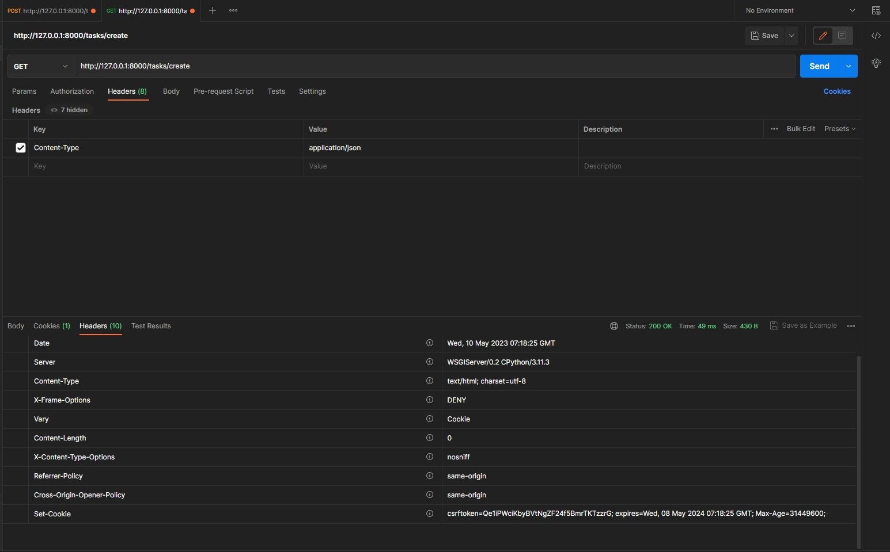

# PRİVİA SECURİTY BACKEND PROJESİ
Bu proje, Django web çerçevesi kullanılarak geliştirilmiş bir web uygulamasıdır. Bu dosya, proje hakkında temel bilgileri içermektedir.    

###  1.Sanal Çalışma Ortamın Hazırlanması     
``` git clone https://github.com/KullaniciAdi/proje-adi.git ``` Proje dosyalarınızı bilgisayarınıza klonlayın.          
``` python -m venv env  ``` Sanal ortam oluşturun.         
``` env\Scripts\activate  ``` Sanal ortamı aktifleştirin.       
```  pip install Django ``` Django kurulum.    
```  dijango-admin startproject priviasecurity  ``` Projeyi başlat.       
```  cd priviasecurity_con ``` Dizine gitme.       
```  python manage.py runserver ``` Projeyi yerel makinenizde çalıştırın.         
http://127.0.0.1:8000/ adresinde proje ana sayfasına erişebilirsiniz.

### 2.Dosya Yapısı MVT ( Model View Template )
  
proje-adi/       
├── uygulama-adi/          
│   ├── migrations/      
│   ├── templates/       
│   ├── static/      
│   ├── views.py      
│   ├── models.py      
│   └── urls.py     
├── proje-adi/      
│   ├── settings.py      
│   ├── urls.py      
│   ├── wsgi.py      
│   └── asgi.py      
├── db.sqlite3       
├── manage.py      
├── requirements.txt      
└── README.md      

uygulama-adi: priviasecurity-backend-task.   
migrations: Django'nun veritabanı model değişikliklerini izlemek için kullanılan dosyalar.    
templates: HTML dosyaları için kullanılan şablonlar.     
static: CSS, JS, resimler gibi statik dosyalar için kullanılan klasör.       
views.py: Django uygulamasındaki kontrollerin bulunduğu dosya.         
models.py: Django uygulamasındaki veritabanı modellerinin tanımlandığı dosya.          
urls.py: Django uygulamasındaki URL yönlendirmelerinin bulunduğu dosya.          
settings.py: Django projesinin genel ayarlarının yapılandırıldığı dosya.         
db.sqlite3: Projenin SQLite veritabanı dosyası.        
manage.py: Django projesinin yönetim arayüzü.         
requirements.txt: Projede kullanılan tüm kütüphanelerin sürümlerinin bulunduğu dosya.             


### 3.Mock Servislerin Eklenmesi Ve Verilerin Modellenmesi
#### 3.1 Mock Servisleri Hakkında
Django projenize mock servisleri eklemek için aşağıdaki adımları takip edebilirsiniz:      
1.Django projesinde bir sanal ortam oluşturun ve bu ortamda mock servislerin kurulumu için gerekli olan kütüphaneleri yükleyin. Bunun için pip kullanabilirsiniz. Örneğin:       
``` pip install requests-mock ```          
Django projesinin bir views.py dosyasında mock servisi kullanmak için, öncelikle requests ve requests_mock kütüphanelerini içe aktarın. Örneğin:      
``` import requests ```       
``` import requests_mock ```      
Mock servisini kullanmak için requests_mock kütüphanesinin mock metodu kullanarak mock servisi ayarlayın. Örneğin:        
``` with requests_mock.Mocker() as mock: ```      
``` mock.get('http://example.com', text='mocked response') ```     
Django projesindeki views.py dosyasındaki ilgili fonksiyonda, mock servisine yapılan istekleri kullanarak kodunuzu test edin. Örneğin:     
``` response = requests.get('http://example.com') ```
``` assert response.status_code == 200 ```
``` assert response.text == 'mocked response' ```

 
#### 3.2 Verilerin Modellenmesi Ve ORM Yapısı
Tasks uygulaması içinde bulunan models.py dosyasında bana verilen entityleri modelledim.          
Migration'lar, modelde yapılan değişiklikleri tanımlayan ve bu değişiklikleri veritabanına nasıl uygulayacağınızı söyleyen Python dosyalarıdır.        
Migration'lar, ``` python manage.py makemigrations ``` komutu kullanılarak oluşturulur ve ``` python manage.py migrate ``` komutu kullanılarak veritabanına uygulanır.            
      
ORM (Object-Relational Mapping), Django'da, nesnelerin veritabanı tablolarıyla etkileşimini kolaylaştıran bir araçtır. Django ORM, veritabanı tablolarının her birini bir Python sınıfı ile temsil eder. Bu Python sınıfları, veritabanı tablolarındaki kayıtları programatik olarak oluşturmanıza, okumanıza, güncellemenize ve silmenize olanak tanır. Böylece, veritabanı işlemleri için SQL diline doğrudan ihtiyaç duymadan, Python kodu üzerinden veritabanı işlemleri yapabilirsiniz.

#### 3.3 Servis Katmanı Oluşturma 
Servis katmanı oluşturmanın temel amacı, iş mantığının, veri erişim işlemlerinden bağımsız olmasını sağlamaktır. Bu sayede, veri erişim katmanında yapılacak değişiklikler, servis katmanını etkilemez. Ayrıca, servis katmanı, veri erişim katmanı gibi doğrudan veritabanı sorguları kullanmaz, bunun yerine ORM aracılığıyla veri işlemlerini gerçekleştirir.            

### 4.API Endpointleri         
#### 4.1 CRUD Endpointleri
``` /tasks/list ``` Yapılacak listesini getirir. ( GET )    
``` /tasks/create ```

#### 4.2 Login Endpointleri    

### 4.3 CSRF Token   
Django'da "CSRF token missing" hatası, Cross-Site Request Forgery (CSRF) saldırılarını engellemek için kullanılan CSRF korumasının devre dışı bırakılması veya eksik olması durumunda ortaya çıkar.      
```  'django.middleware.csrf.CsrfViewMiddleware' ``` setting.py de bir middleware olan setcookie başlığında bulunan csrftokeni POST isteğinde bulunurken X-CSRFToken başlığını eklemeli ve tokeni girmeliyizdir. CSRFTokeni Postman de cookies keyi ekleyerek GET isteği atarak alabiliriz.     
 